# SwingTrade — Supabase ER Diagram

**Schema version 004** · 21 tables across 7 logical clusters · synced from SQLite (canonical) via `migrate_sqlite_to_supabase.py`.

## Cluster overview

| Cluster | Tables | Purpose |
|---|---|---|
| **Daily scan** | `runs`, `picks`, `trades` | One row per scan invocation + every pick + every simulated trade. FK-linked. |
| **Signal journal** | `signal_log`, `signal_filter_decisions` | Every BUY/WATCH/SHORT signal + the gate decision behind it. |
| **Portfolio** | `portfolio_state`, `positions`, `closed_trades`, `equity_audit`, `equity_curve`, `monthly_pnl` | Live account, open positions, exits, equity timeline. |
| **Watchlist / alerts** | `custom_tickers`, `watch_triggers`, `alert_log` | User-added tickers + trigger events + alert-dedup keys. |
| **Health / events** | `scan_health`, `gap_events` | Per-scan health stats + overnight gap actions. |
| **Backtest** | `backtest_runs`, `backtest_trades`, `walk_forward_folds` | Backtest invocations + per-trade ledger + WF fold tuning. |
| **System** | `meta`, `paper_trading_config`, `supabase_sync_state` | Key/value, paper-trade gate, sync ledger. |

## Full ER diagram

```mermaid
erDiagram
  %% =================== FK relationships (enforced) ===================
  runs ||--o{ picks : "1:N"
  runs ||--o{ trades : "1:N"
  backtest_runs ||--o{ backtest_trades : "1:N"
  backtest_runs ||--o{ walk_forward_folds : "1:N"

  %% =================== Logical relationships (no FK) =================
  positions }o..o{ closed_trades : "closes to"
  portfolio_state }o..|| equity_audit : "audited by"
  portfolio_state }o..|| equity_curve : "snapshotted by"
  closed_trades }o..|| monthly_pnl : "aggregates to"
  custom_tickers }o..|| watch_triggers : "triggers"
  signal_log }o..|| signal_filter_decisions : "audited by"
  signal_log }o..|| trades : "compares to"

  %% =================== Daily scan cluster ============================
  runs {
    bigint id PK
    date   run_date
    timestamptz run_time
    text   regime
    int    num_picks
    int    evaluated
  }
  picks {
    bigint id PK
    bigint run_id FK
    text   ticker
    text   direction
    text   verdict
    double score
    double rs_rank
    text   setup_type
    text   setup_family
    double entry_price
    double stop
    double target1
    double target2
    timestamptz first_seen_time
    int    updated_count
    jsonb  raw_json
  }
  trades {
    bigint id PK
    bigint run_id FK
    date   run_date
    text   ticker
    text   direction
    double entry_price
    double exit_price
    double pct_chg
    int    win
    double score
    int    hold_days
    text   setup_family
    text   regime
    int    catalyst_tier
    text   entry_quality
    text   sector
    text   conviction_tier
    double mae
    double mfe
    jsonb  raw_json
  }

  %% =================== Signal journal cluster ========================
  signal_log {
    bigint id PK
    timestamptz date
    text   ticker
    text   strategy
    double entry_price
    double stop
    double target1
    double target2
    double rr
    int    stars
    double score
    double rs_rank
    text   direction
    text   status
    double day5_price
    double day10_price
    double actual_pnl_pct
    text   result
    double mae_pct
    double mfe_pct
    text   outcome_5d
    text   outcome_10d
    jsonb  raw_json
  }
  signal_filter_decisions {
    bigint id PK
    timestamptz decided_at
    text   ticker
    text   setup_type
    text   setup_family
    text   regime
    int    score
    text   score_band
    text   entry_quality
    bool   allow
    text   matched_rule_id
    text   reason
    text   config_hash
    jsonb  raw_context
  }

  %% =================== Portfolio cluster =============================
  portfolio_state {
    int    id PK
    double equity
    double cash
    double margin_reserved
    timestamptz updated_at
  }
  positions {
    bigint id PK
    text   ticker
    text   direction
    timestamptz entry_date
    double entry_price
    int    shares
    double position_size
    double stop
    double trail_stop
    int    trail_active
    double highest_price
    double current_price
    double target1
    double target2
    text   setup_type
    double allocation_pct
    text   notes
    text   entry_regime
    jsonb  raw_json
  }
  closed_trades {
    bigint id PK
    text   ticker
    text   direction
    timestamptz entry_date
    timestamptz exit_date
    double entry_price
    double exit_price
    int    shares
    double pnl_dollars
    double pnl_pct
    int    win
    text   setup_type
    text   exit_reason
    int    hold_days
    double mae
    double mfe
    text   regime
    jsonb  raw_json
  }
  equity_audit {
    bigint id PK
    timestamptz timestamp
    double old_equity
    double new_equity
    double old_cash
    double new_cash
    double invested
    text   reason
  }
  equity_curve {
    bigint id PK
    date   date
    double equity
  }
  monthly_pnl {
    text   year_month PK
    double pnl
  }

  %% =================== Watchlist / alerts cluster ====================
  custom_tickers {
    text   ticker PK
    double entry_price
    date   entry_date
    text   entry_time
    text   note
    timestamptz added_at
    text   source
    jsonb  raw_json
  }
  watch_triggers {
    bigint id PK
    text   ticker
    timestamptz triggered_at
    date   run_date
    jsonb  raw_json
  }
  alert_log {
    text   alert_key PK
    date   last_sent_date
  }

  %% =================== Health / events cluster =======================
  scan_health {
    bigint id PK
    timestamptz ts
    int    total
    int    killed
    double pct
    jsonb  raw_json
  }
  gap_events {
    bigint id PK
    timestamptz ts
    text   ticker
    double prev_close
    double open_price
    double gap_pct
    text   direction
    text   severity
    text   action
    double new_stop
    jsonb  raw_json
  }

  %% =================== Backtest cluster ==============================
  backtest_runs {
    bigint id PK
    text   run_id UK
    timestamptz started_at
    timestamptz finished_at
    text   mode
    int    days
    date   end_date
    int    min_score
    int    min_rs
    int    n_trades
    double wr_raw
    double wr_adj
    double profit_factor
    double sharpe
    double max_drawdown
    double total_pnl
    double starting_equity
    double final_equity
    double total_return
    jsonb  config_snapshot
    text   git_commit
    text   notes
    text   raw_stdout
  }
  backtest_trades {
    bigint id PK
    text   run_id FK
    text   ticker
    text   direction
    date   entry_date
    date   exit_date
    double entry_price
    double exit_price
    int    shares
    double pnl_dollars
    double pnl_pct
    int    win
    text   setup_family
    text   setup_type
    int    score
    double rs_rank
    text   regime
    text   exit_reason
    int    hold_days
    double mae_pct
    double mfe_pct
    jsonb  raw_json
  }
  walk_forward_folds {
    bigint id PK
    text   run_id FK
    int    fold_index
    date   train_start
    date   train_end
    date   test_start
    date   test_end
    int    tuned_min_score
    int    tuned_min_rs
    jsonb  tuned_extras
    int    test_n_trades
    double test_wr
    double test_pf
    double test_sharpe
    double test_max_dd
    int    train_n_trades
    double train_wr
    double train_pf
  }

  %% =================== System cluster ================================
  meta {
    text   key PK
    jsonb  value
  }
  paper_trading_config {
    int    id PK
    date   start_date
    int    duration_days
    int    enabled
    timestamptz disabled_at
    text   direction_filter
    int    max_daily_trades
  }
  supabase_sync_state {
    text   table_name PK
    timestamptz last_sync_at
    int    source_rows
    int    pushed
    int    failed
    text   error_msg
    int    duration_ms
  }
```



## Relationship notes

**Enforced FKs (with `ON DELETE CASCADE`)**
- `picks.run_id → runs.id` — deleting a run wipes its picks
- `trades.run_id → runs.id` — same for simulated trades
- `backtest_trades.run_id → backtest_runs.run_id` — keyed by `run_id` (text), not `id`
- `walk_forward_folds.run_id → backtest_runs.run_id`

**Logical-only (no FK, joined by application code)**
- `positions` → `closed_trades` — when a position exits, the engine inserts a row in `closed_trades` and deletes the position
- `portfolio_state` ← `equity_audit` — every mutation to `portfolio_state.equity` writes an audit row
- `portfolio_state` ← `equity_curve` — daily snapshot at market close
- `closed_trades` → `monthly_pnl` — aggregated by `year_month = YYYY-MM`
- `custom_tickers` → `watch_triggers` — a trigger fires when a custom ticker meets a watch condition
- `signal_log` → `signal_filter_decisions` — each signal is gated by the A2 filter; decisions logged separately
- `signal_log` → `trades` — `signal_log` is the live journal; `trades` is the backtest equivalent

**Meta tables**
- `meta` — key/value bag including `schema_version`
- `supabase_sync_state` — per-table sync ledger, written by `migrate_sqlite_to_supabase.py`

## Sync flow

```
SQLite (data/swingtrade.db)
        │
        │  migrate_sqlite_to_supabase.py --apply
        │  (runs every 30min via launchd)
        ▼
JSON canonical (data/*.json) ── merged ──▶ Supabase Postgres
        │                                          │
        │                                          ▼
        │                                  supabase_sync_state ledger
        ▼                                          │
data/supabase_sync_state.json ◀───────────────────┘
        │
        ▼
GET /api/supabase/status  (cached 30s)
        │
        ▼
Kairos · Supabase tab  (live drift dashboard)
```
